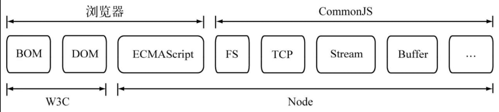
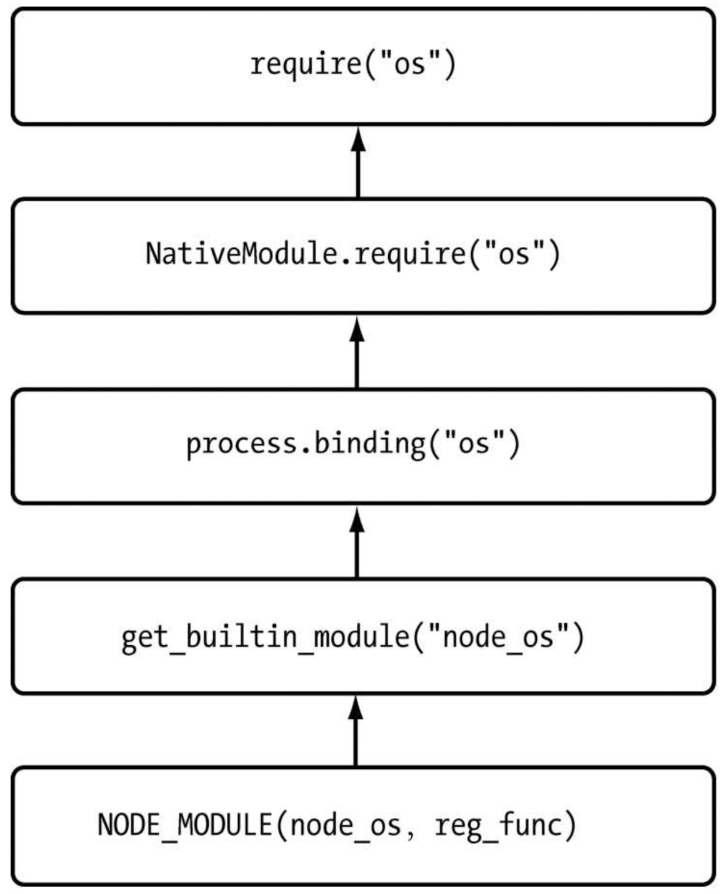

# Chapter 2：模块机制

> CommonJS 是一个 JavaScript 模块化的规范，用于在服务器端和其他运行环境中加载和使用模块。它定义了一种模块的编写、导入和导出方式，使得开发者可以更加方便地组织和管理代码。

## 2.1 CommonJS



### 简介

在 CommonJS 规范中，一个模块被定义为一个单独的文件，每个文件就是一个模块。每个模块都有自己的作用域，模块中的变量、函数、对象在模块外部是不可见的，除非将其显式地导出。

导出模块中的内容可以使用`module.exports`或`exports`对象来实现。`module.exports`直接导出一个值或对象，而`exports`是`module.exports`的一个引用，可以通过给`exports`对象上添加属性的方式导出多个值或对象。

在另一个模块中要使用已导出的值或对象，可以使用`require`函数进行导入。`require`函数接受一个模块路径作为参数，返回目标模块导出的内容。

下面是一个使用 CommonJS 模块化规范的示例：

```javascript
// math.js
const add = (a, b) => a + b;

module.exports = {
  add,
};

// index.js
const math = require('./math');

console.log(math.add(2, 3)); // 输出: 5
```

在以上示例中，`math.js`模块导出了一个`add`函数，`index.js`模块通过`require`函数导入了`math.js`模块，并使用`math.add`调用了导出的函数。

CommonJS 模块化规范主要用于服务器端的 JavaScript 开发，以及一些支持 CommonJS 规范的客户端框架和工具中。在浏览器环境下，通常使用 ES6 的模块化规范（即使用`import`和`export`关键字）来替代 CommonJS 规范。

### 与 ES6 模块化规范的不同

CommonJS 模块化规范和 ES6 的模块化规范在许多方面有所不同。以下是它们之间的一些主要区别：

1. 语法：CommonJS 使用`require`和`module.exports`关键字来导入和导出模块，而 ES6 使用`import`和`export`关键字来实现。ES6 的语法更加简洁和直观。

2. 静态解析：ES6 的模块是静态的，意味着模块的依赖关系在代码编译阶段就可以确定。这样可以提前进行优化和处理。而 CommonJS 的模块在运行时动态地加载和解析，使得在解析过程中无法进行静态优化。

3. 异步加载：CommonJS 模块是同步的，模块的加载是阻塞的，在模块加载完成之前，后续代码无法执行。ES6 的模块是异步的，可以使用`import()`动态地加载模块，并且不会阻塞后续代码的执行。

4. 导入和导出的特性：ES6 的模块导入和导出的特性更加强大和灵活。ES6 模块支持按需导入和导出，可以选择性地导入和导出模块中的特定内容。而 CommonJS 模块只能导入和导出整个模块对象。

5. 编译时静态分析：由于 ES6 模块在编译时可以进行静态分析，一些工具和构建器（如 Webpack 和 Rollup）可以进行模块的静态分析和优化，从而提高性能和减小文件大小。

总体而言，ES6 的模块化规范比 CommonJS 更加先进和灵活，特别适合在浏览器环境下进行前端开发。然而，在服务器端 JavaScript 开发中，CommonJS 仍然广泛使用，因为它对于动态加载和运行时的特性更加适用。

## 2.2 执行过程

1. 路径分析

- 核心模块：http、fs...
- 文件模块：文件模块提供模块缓存，缓存的内容是编译和执行后的对象
  - 绝对路径的文件模块
  - 相对路径的文件模块
  - 非路径形式的文件模块

使用路径形式加载的模块，会降路径转化为真实的路径，将真实路径作为索引，将编译后的节后放进缓存中，使二次加载更快。

非路径形式的自定义模块的加载较为负载。逐级查找 node_modules 中的模块，速度最慢。

2. 文件定位

- 文件扩展名解析的时候，依次查找的是 index.js、index.json、index.node 文件。

3. 编译执行

- NodeJS 中每一个文件模块都是一个对象，在引入时进行编译执行，并在编译成功之后将文件路径作为引用缓存起来。

- 编译的过程
  - 文件模块的编译
    - .js 文件，fs.readFile 读取文件，并编译执行，匿名函数的形式执行
      - 对 JS 文件进行头尾包裹，编程匿名函数
      - 执行匿名函数，同时传入模块对象的 exports 属性、require 方法等
    - .node 文件，process.dlopen 的方式读取
      - .node 文件是 C/C++模块编译生成后的文件，不需要再进行编译，只用加载和执行
    - .json 文件，JSON.parser 的形式读取
  - 核心模块的编译
    - js 模块
      - 转存为 C/C++代码，编程 C/C++数组，执行时取出再转为字符串使用
      - 和文件模块不同的在于
        - 1. 缓存的位置不同
        - 2. 获取的位置不同，核心模块是从内存中获取
    - C/C++模块（内建模块）
      - 当 node 进程开始执行时，文件被编译成二进制，存入内存中，无须再次做标识符定位、文件定位、编译等过程，可以直接使用。
        
        
        ！[link](./imgs/rel.png)

## 2.3 npm 包

```
├── bin
├── lib
├── test
├── doc
└── package.json
```
