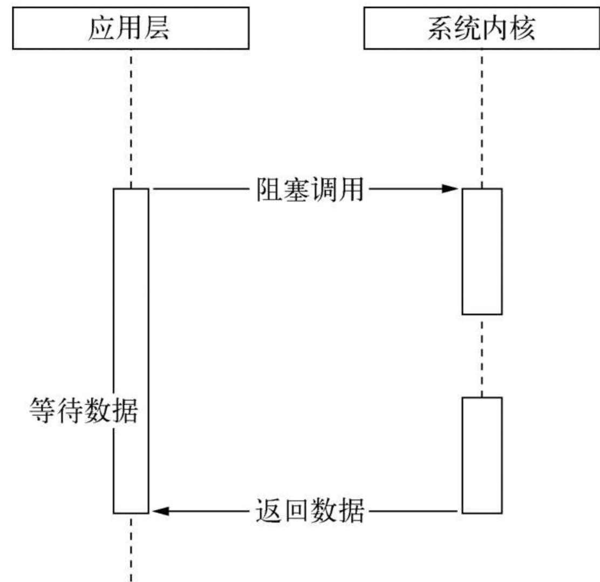
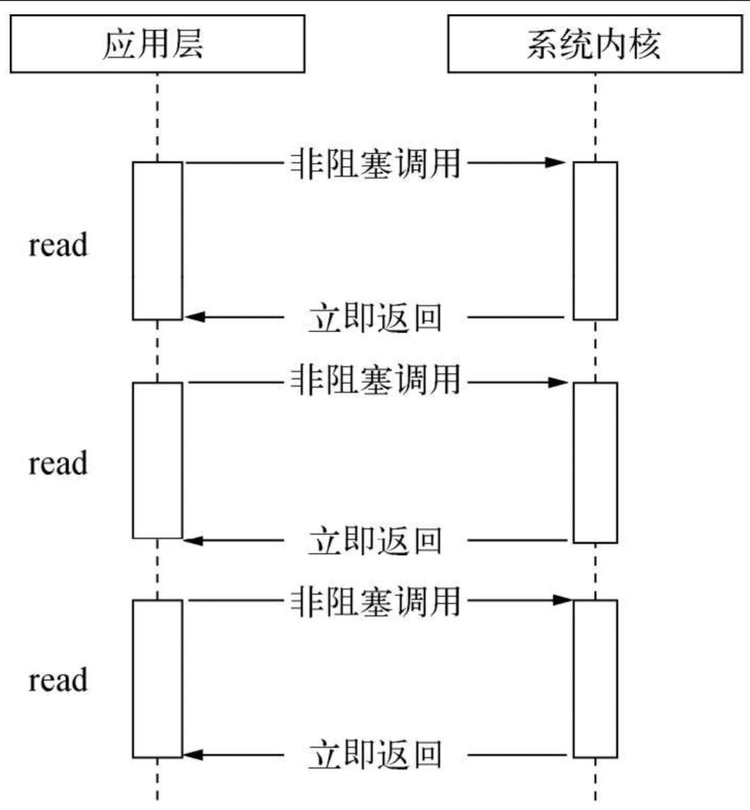
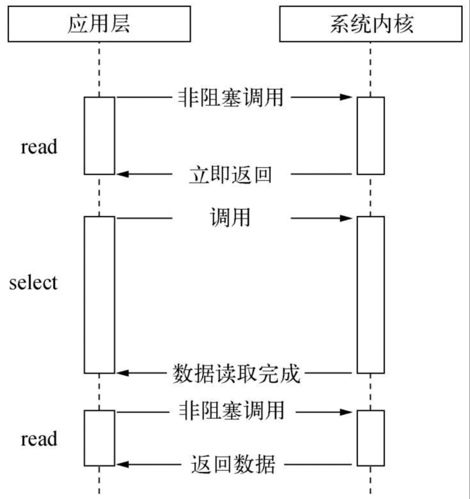
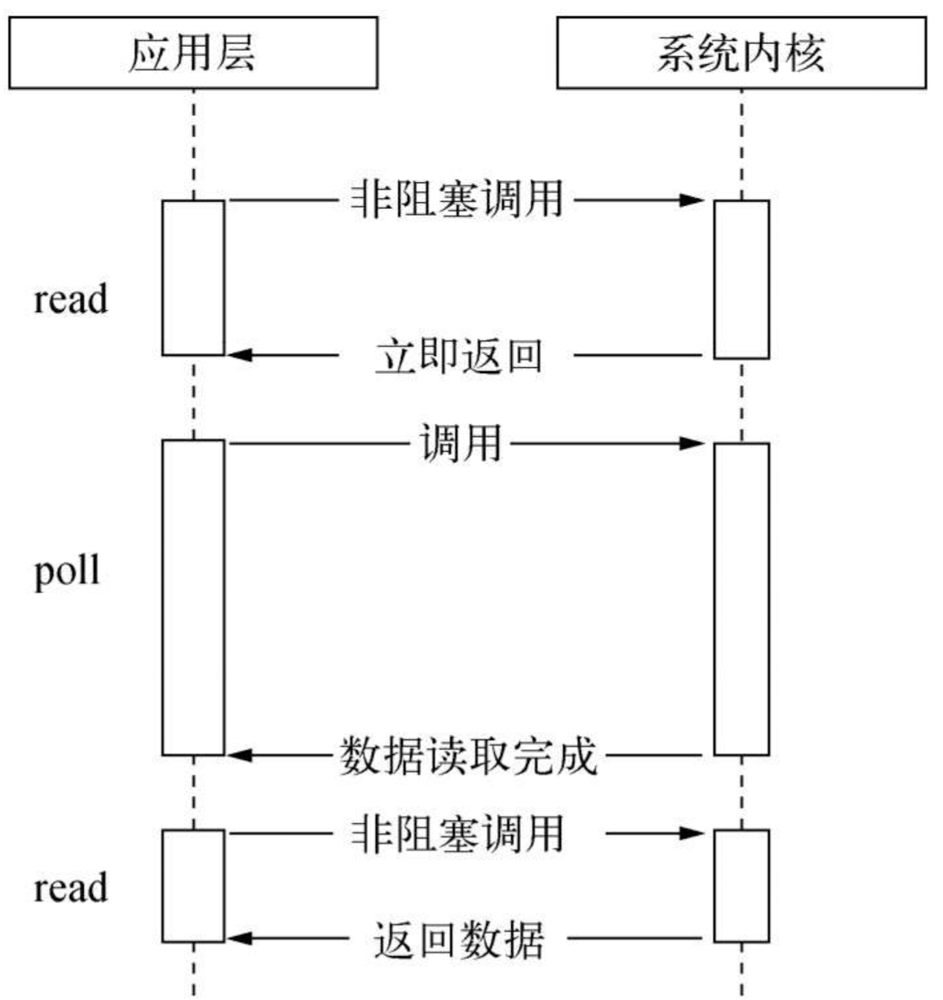
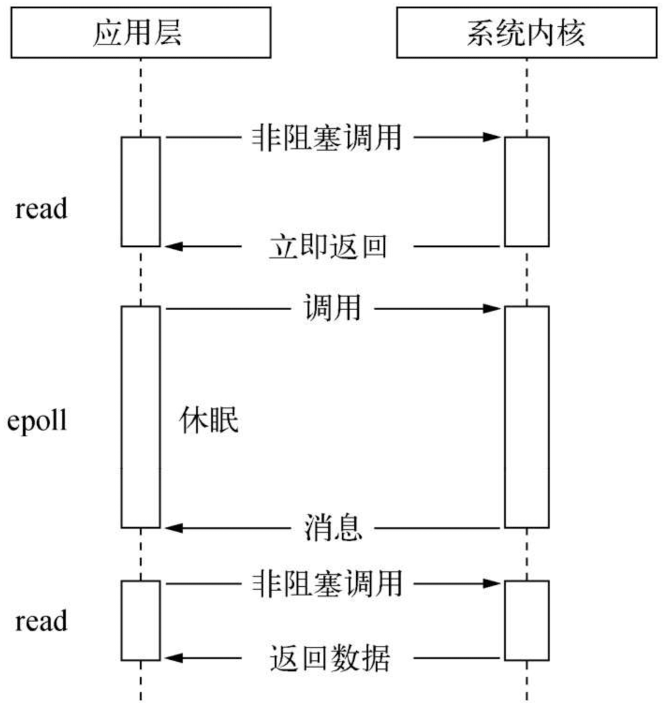
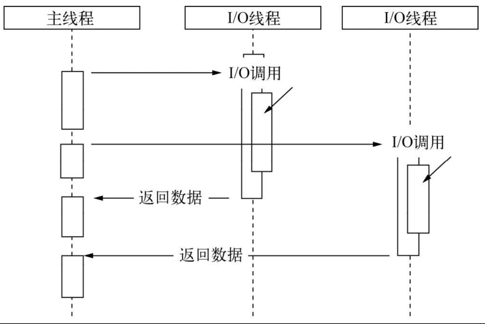
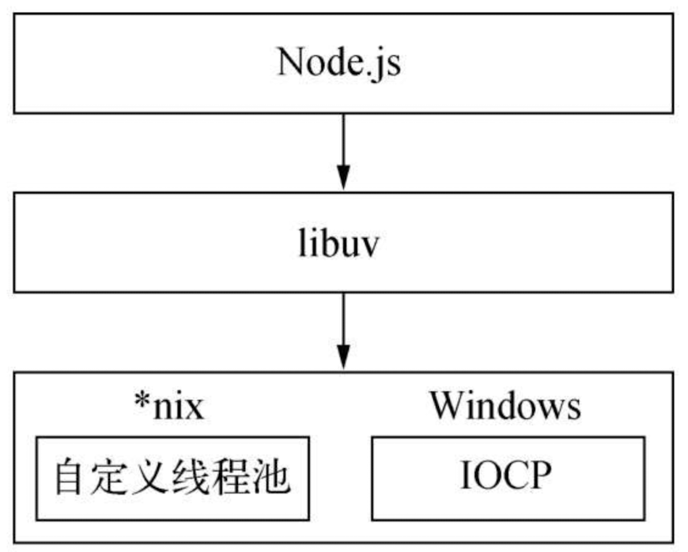
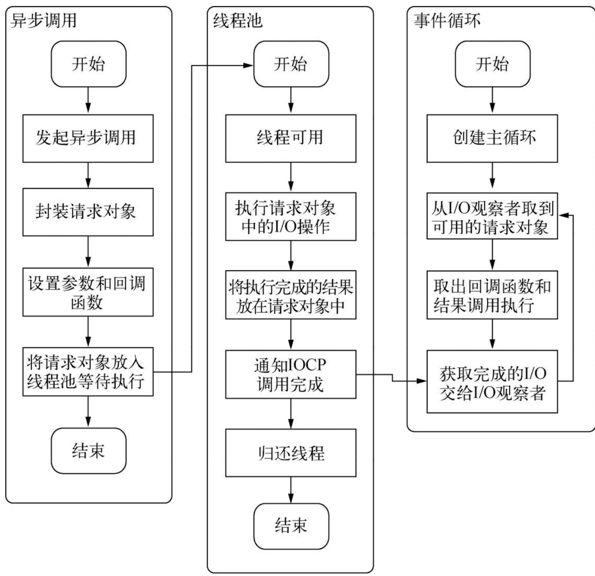
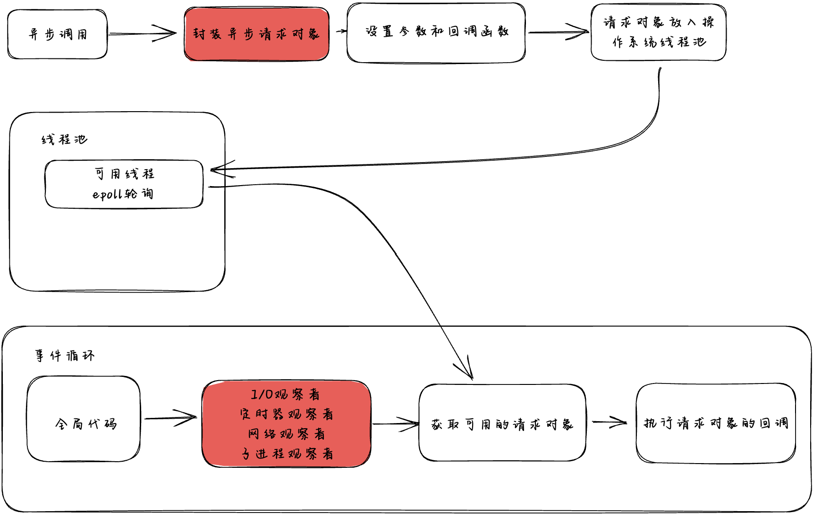

# Chapter 3 I/O

## 3.1 非阻塞 I/O 和阻塞 I/O

> I/O 行为有阻塞和非阻塞的区别。（[阻塞与非阻塞](https://nodejs.org/zh-cn/docs/guides/blocking-vs-non-blocking)）其中的阻塞是通过同步来实现的，非阻塞是通过异步来实现的。

- 非阻塞 I/O
  
  例如：

  - setTimeout()
  - setInterval()
  - setImmediate()
  - process.nextTick()

- 阻塞 I/O
  

_Node 非阻塞的 I/O 在系统层面是调用了底层的 epoll 轮询。同时使用了系统层面的线程池。_

## 3.2 轮询

> 轮询是有规律的检查一个特定的事件或者条件。轮询会涉及对某一数据结构中某一个值或者状态的重复的检查，或者针对外部设备输入的一个检查。在事件驱动的编程中，经常会用到轮询技术。轮询会持续的检查某一个事件的发生或者条件的变更，而不是通过事件发生后的回调来打断。轮询经常应用在需要针对状态变化或者输入变化做出响应的场景中。例如，用户交互、设备驱动等。
> 轮询的实现方式有很多种方式，使用一个循环或者使用一个定时器。轮询是一中对资源敏感的技术。他是利用 CPU 的周期去持续的检查状态的变化，最终会导致的一个结果就是性能变慢和资源占用过高。在事件驱动的程序中，会使用一中回调机制，当事件发生时，会调用对应的回调，这是一中比轮询更高效的技术。

linux/Unix 系统层面轮询有以下几种实现方式：

- read
  
- select
  
  当使用 `select` 函数进行轮询调用时，一般需要以下步骤：

  1. 准备文件描述符集合：将需要进行轮询的文件描述符添加到一个集合中，通常是使用 `fd_set` 数据结构来表示。这个集合分为三个部分：读取（read）、写入（write）和异常（exception）。你需要根据需要修改相应的集合。

  2. 设置超时时间：可以选择设置一个超时时间，即在等待过程中最长允许的时间。如果超过该时间，`select` 函数将返回，可以根据返回值判断是超时还是有文件描述符可读。

  3. 调用 `select` 函数：调用 `select` 函数来进行轮询。函数原型如下：

     ```c
     int select(int nfds, fd_set *readfds, fd_set *writefds, fd_set *exceptfds, struct timeval *timeout);
     ```

     - `nfds`：指定被监听的文件描述符中最大的文件描述符号加 1。
     - `readfds`：指向待检查的读取集合。
     - `writefds`：指向待检查的写入集合。
     - `exceptfds`：指向待检查的异常集合。
     - `timeout`：指定等待的超时时间，可以为 `NULL` 表示无限等待。

  4. 检查返回值：在 `select` 调用返回后，需要检查其返回值。返回值大于 0 表示有文件描述符可读，返回值为 0 表示超时，返回值为 -1 表示发生错误。

  5. 处理可读文件描述符：对于返回值大于 0 的情况，需要遍历文件描述符集合，检查每个文件描述符是否处于可读状态，进行相应的读取操作。

  6. 重复轮询：如果还有需要监测的文件描述符，可以重新设置文件描述符集合并进行下一次轮询调用。通常使用循环结构来实现多次轮询。

  需要注意的是，`select` 函数在轮询过程中会改变传入的文件描述符集合，因此在每次轮询调用前需要重新设置并初始化文件描述符集合。在实际使用中，可以根据需要对读取、写入和异常集合进行相应的设置。此外，`select` 函数的性能在一些场景下可能不够高效，可能需要考虑使用更高级的 I/O 多路复用技术，如 `epoll`（Linux）或 `kqueue`（BSD/MacOS）。

- poll
  
  poll 是另一种用于实现轮询的系统调用，与 select 类似，也可以监测多个文件描述符的可读性。它使用一个 pollfd 结构体数组来传递待查询的文件描述符及其感兴趣的事件。poll 函数会等待，直到指定的某个文件描述符上的事件发生。一旦有事件发生，poll 就会返回，并告知发生事件的文件描述符。poll 能够处理的文件描述符数量没有上限，它相对于 select 的优点在于更加灵活，并且对高并发情况下的性能有一定的提升。

在 Linux 中，可以使用系统调用 poll() 来实现轮询。poll() 函数允许程序在一组文件描述符上等待事件的发生，直到超时或事件发生为止。该函数的原型如下：

```C++
#include <poll.h>

int poll(struct pollfd *fds, nfds_t nfds, int timeout);
```

其中，参数 fds 是一个指向 pollfd 结构体数组的指针，每个 pollfd 结构体表示一个要检查的文件描述符，nfds 是 fds 数组的大小，timeout 是等待的超时时间，单位是毫秒。

pollfd 结构体的定义如下：

```C++
struct pollfd {
    int fd;         /* 文件描述符 */
    short events;   /* 要等待的事件 */
    short revents;  /* 实际发生的事件 */
};
```

在调用 poll() 函数之后，程序会一直阻塞等待，直到任何一个文件描述符中的事件发生，或等待超时。如果发生了一个或多个事件，poll() 函数会返回一个大于 0 的整数，表示发生事件的文件描述符的数量。此时，每个 pollfd 结构体的 revents 成员将被设置为实际发生的事件。

下面是一个简单的示例代码，演示了如何使用 poll() 函数在标准输入上等待输入事件的发生：

```C++
#include <stdio.h>
#include <poll.h>

int main() {
    struct pollfd fds[1];
    fds[0].fd = 0; /* 标准输入的文件描述符 */
    fds[0].events = POLLIN;

    printf("Waiting for input...\n");

    while (1) {
        int ret = poll(fds, 1, -1); /* 等待事件发生 */
        if (ret > 0) {
            printf("Input received!\n");
            break;
        }
    }

    return 0;
}
```

在上面的示例中，程序创建了一个 pollfd 结构体数组，其中包含一个文件描述符为标准输入的结构体。程序将 POLLIN 事件设置为要等待的事件，表示等待输入事件的发生。然后程序进入一个循环，在循环中调用 poll() 函数等待事件的发生。如果发生了输入事件，程序会输出一条消息并退出循环。如果等待超时，程序会继续等待。

- epoll
  
  Linux epoll 是一种高效的 I/O 事件通知机制，它可以用于实现高性能的网络编程。在传统的 I/O 模型中，应用程序需要不断地轮询 I/O 事件是否已经就绪，这样会导致大量的 CPU 时间浪费在轮询上。而 epoll 机制能够避免这种浪费，只有在 I/O 事件就绪时才会通知应用程序，从而提高了应用程序的性能和响应速度。

  epoll 机制的主要特点如下：

  1. 支持较多的并发连接：epoll 机制可以同时支持数以万计的并发连接。

  2. 高效的事件通知机制：epoll 机制只有在 I/O 事件就绪时才会通知应用程序，避免了不必要的 CPU 时间浪费。

  3. 支持多种事件类型：epoll 机制支持多种事件类型，包括读、写和异常等。

  4. 零拷贝技术：epoll 机制可以使用零拷贝技术，避免了数据从内核空间到用户空间的多次拷贝，提高了数据传输的效率。

  在使用 epoll 机制时，需要完成以下步骤：

  1. 创建 epoll 实例：使用 `epoll_create()` 函数创建一个 epoll 实例，返回一个文件描述符。

  2. 注册事件：将需要监听的文件描述符注册到 epoll 实例中，使用 `epoll_ctl()` 函数实现。

  3. 等待事件：使用 `epoll_wait()` 函数等待事件的发生，并返回就绪的文件描述符和相应的事件类型。

  4. 处理事件：根据返回的就绪文件描述符和相应的事件类型，进行相应的处理。

  总的来说，epoll 机制是一种高效的 I/O 事件通知机制，能够避免传统 I/O 模型中的轮询浪费 CPU 时间的问题，提高了应用程序的性能和响应速度。在 Linux 中，epoll 机制已经成为了实现高性能网络编程的重要基础。

- kqueue

### NodeJS 的实现

> 线程池加阻塞 I/O 的方式实现的





- 在 \*uix 系统中使用线程池来实现
- 在 windows 平台使用 IOCP 实现

事件循环


[什么是轮询](https://www.techtarget.com/whatis/definition/polling)

## 3.3 NodeJS 事件循环

> 服务器处理请求的策略有：1. 同步式；2. 每进程/每请求；3. 每线程/每请求；NodeJS 使用的是事件驱动的方式。



NodeJS 的事件循环机制有三个重要的组成部分：

- 事件循环
- 观察者
- 请求对象

Node.js 的事件循环机制是实现异步编程的核心机制。在 Node.js 中，事件循环机制由三个部分组成：事件循环、观察者和请求对象。

事件循环是一个持续运行的循环，它会不断地从事件队列中获取事件并执行相应的回调函数。事件队列是一个先进先出的队列，存储了需要处理的事件及其相应的回调函数。当事件循环从事件队列中获取一个事件时，它会执行该事件的回调函数，并将事件从事件队列中移除。

观察者用于在事件循环中处理事件队列。
在事件循环中，观察者会检查底层 I/O 操作是否已经完成，如果完成了就将事件添加到事件队列中等待处理。

请求对象是包含观察者和其他一些参数的对象，用来传递数据和状态信息。在 Node.js 应用程序中，可以通过调用异步函数来创建一个请求对象，并将其添加到事件队列中等待处理。当请求对象被添加到事件队列中时，它会通过观察者来注册相应的 I/O 事件，并将事件添加到事件队列中等待处理。



在 Node.js 中，观察者（Watcher）是用于监视异步 I/O 操作的一种机制。观察者会在 I/O 操作完成后触发相应的回调函数，从而实现异步编程。Node.js 中常见的观察者包括以下几种：

- I/O 观察者（I/O Watcher）：用于监视文件 I/O 操作的完成情况，包括文件读取、文件写入等等。

- 定时器观察者（Timer Watcher）：用于监视定时器的到期时间是否已经到达，从而触发相应的回调函数。

- 网络观察者（Network Watcher）：用于监视网络 I/O 操作的完成情况，包括 TCP 连接的建立、数据的传输等等。

- 子进程观察者（Child Process Watcher）：用于监视子进程的状态变化，包括子进程的退出、错误等等。

这些观察者都是基于事件循环机制实现的，当相应的 I/O 操作完成时，会将其结果添加到事件队列中，从而触发相应的回调函数执行。在 Node.js 中，可以使用各种异步 API 来创建相应的观察者，例如 setTimeout()、setInterval()、setImmediate()、fs.readFile() 等等。

需要注意的是，观察者只是事件循环机制中的一部分，它们并不是 Node.js 中所有异步操作的实现方式。在底层的 I/O 操作中，Node.js 会使用 epoll 等高效的 I/O 事件通知机制，避免了长时间的轮询和阻塞，提高了应用程序的性能和响应速度。
Node.js 的事件循环机制的流程如下：

1. 执行全局代码，并将所有需要执行的回调函数添加到事件队列中。
2. 运行事件循环，从事件队列中获取事件并执行相应的回调函数。(询问观察者)
3. 当事件循环中没有需要执行的事件时，事件循环会进入休眠状态，等待新的事件被添加到事件队列中。
4. 当有新的事件被添加到事件队列中时，事件循环会被唤醒，并开始处理新的事件。

在 Node.js 应用程序中，事件循环是单线程运行的。这意味着事件循环只能一次处理一个事件，如果事件的处理时间过长，事件循环会被阻塞，导致其他事件无法被及时处理。为了避免这种情况，Node.js 采用了异步回调函数的机制，将长时间运行的操作转移到后台线程中处理，从而避免了事件循环的阻塞。

总的来说，Node.js 的事件循环机制是通过事件队列、观察者和请求对象等组件实现的。事件循环会不断地从事件队列中获取事件并执行相应的回调函数，从而实现异步编程。

## 3.4 观察者模式

观察者模式（Observer Pattern）是一种常见的设计模式，它定义了一种一对多的依赖关系，当一个对象的状态发生改变时，它的所有依赖者都会收到通知并自动更新。观察者模式常用于事件驱动的编程中，例如 GUI 程序开发、浏览器端的事件处理等等。

下面是一个使用 JavaScript 实现观察者模式的例子：

```javascript
// 定义一个主题对象
class Subject {
  constructor() {
    this.observers = []; // 保存所有观察者
  }

  // 添加观察者
  addObserver(observer) {
    this.observers.push(observer);
  }

  // 移除观察者
  removeObserver(observer) {
    const index = this.observers.indexOf(observer);
    if (index !== -1) {
      this.observers.splice(index, 1);
    }
  }

  // 通知所有观察者
  notifyObservers() {
    this.observers.forEach((observer) => {
      observer.update();
    });
  }

  // 修改状态，并通知所有观察者
  setState(state) {
    this.state = state;
    this.notifyObservers();
  }

  // 获取当前状态
  getState() {
    return this.state;
  }
}

// 定义一个观察者对象
class Observer {
  constructor(name, subject) {
    this.name = name;
    this.subject = subject;
    this.subject.addObserver(this);
  }

  // 接收通知并更新状态
  update() {
    console.log(
      `${this.name} 收到通知，当前状态为：${this.subject.getState()}`
    );
  }
}

// 创建一个主题对象
const subject = new Subject();

// 创建两个观察者对象
const observer1 = new Observer('Observer 1', subject);
const observer2 = new Observer('Observer 2', subject);

// 修改主题对象的状态，并通知所有观察者
subject.setState('state 1');
// Output: Observer 1 收到通知，当前状态为：state 1
//         Observer 2 收到通知，当前状态为：state 1

// 移除一个观察者
subject.removeObserver(observer2);

// 修改主题对象的状态，并通知所有观察者
subject.setState('state 2');
// Output: Observer 1 收到通知，当前状态为：state 2
```

在上面的代码中，我们定义了一个主题对象 `Subject` 和一个观察者对象 `Observer`。主题对象维护了一个观察者列表，可以添加、移除和通知观察者。观察者对象可以接收通知并更新自身状态。

在示例中，我们创建了两个观察者对象，并将它们添加到主题对象的观察者列表中。当修改主题对象的状态时，所有观察者都会收到通知并更新自身状态。

总的来说，观察者模式是一种常见的设计模式，它可以实现对象之间的松耦合关系，从而提高代码的可维护性和可扩展性。在 JavaScript 中，可以使用类、函数等方式来实现观察者模式。
