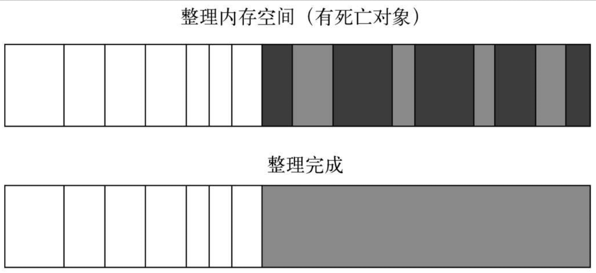
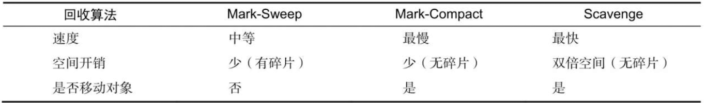

# Chapter 5 内存控制

## V8 虚拟机

V8 是一款由 Google 开发的高性能 JavaScript 引擎，用于解释和执行 JavaScript 代码。它最初是为 Google Chrome 浏览器而开发的，但现在已经被许多其他应用程序采用，例如 Node.js 和 MongoDB。

V8 引擎是一个基于事件驱动的执行引擎，它使用了许多优化技术来提高执行速度，其中最重要的是即时编译（Just-In-Time Compilation，JIT）。当 JavaScript 代码被解释器解释执行时，V8 引擎会将代码编译成本地机器码，这样就可以大大提高代码的执行速度。

V8 引擎还具有一些其他的优化技术，例如内联缓存、隐藏类和垃圾回收等，这些技术都有助于提高 JavaScript 代码的性能和执行效率。

Node.js 的内存上限取决于操作系统和可用的物理内存。在 64 位操作系统上，Node.js 的内存上限大约为 1.4GB，因为 V8 引擎使用的是指针压缩技术，能够最大程度地减小指针的大小，从而将可用内存空间最大化。

但是，在 32 位操作系统上，Node.js 的内存上限只有 0.7GB，因为 32 位系统的内存地址空间有限，无法支持大于 0.7GB 的单个进程内存使用。

需要注意的是，即使在 64 位操作系统上，也不建议在单个 Node.js 进程中使用大量的内存，因为这可能会导致性能下降和操作系统的不稳定。在这种情况下，应该考虑使用分布式系统或使用多个进程来处理大量的内存需求。

## 堆内存（Heap Memory）

是计算机内存管理中的一种重要的内存分配方式，它用于存储动态分配的数据，如对象、数组等。堆内存是由程序员自行分配和释放的，通常需要手动管理内存的生命周期。

堆内存的特点包括：

1. 动态分配：堆内存可以动态地分配内存空间，程序员可以根据需要动态地创建和销毁对象、数组等数据结构。

2. 随机访问：堆内存中的数据结构可以随机访问，即可以通过数组下标或对象属性访问任意位置的数据。

3. 慢速分配：堆内存的分配和释放比栈内存慢，因为堆内存需要动态地管理内存空间，并进行垃圾回收等操作。

4. 自由管理：堆内存的管理由程序员自行负责，需要手动进行内存的分配和释放，避免内存泄漏和内存溢出等问题。

5. 大容量：堆内存通常具有较大的容量，可以存储大量的数据结构。

在大多数编程语言中，堆内存是通过 new 操作符动态分配的，程序员需要手动管理内存的生命周期，并在使用完毕后及时释放内存，避免内存泄漏和内存溢出等问题。在一些编程语言中，如 C++，程序员需要手动进行堆内存的分配和释放，而在一些其他编程语言中，如 Java、Python，堆内存的管理由虚拟机自动进行，程序员无需手动管理内存。

## V8 垃圾回收算法

> 分代式垃圾回收。新生代为存活时间段的对象，老生代为存活时间较长的对象。

- 新生代

  - Scavenge 算法（Cheney 算法）：将新生代的堆内存分为两个空间，一个 From 空间，一个 To 空间。
  - 在垃圾回收时，会先检查 From 空间中的存活对象，并复制到 To 空间
  - 释放 From 空间中的非存活对象
  - 置换 From 空间和 To 空间的对象
  - 缺点是只能使用新生代内存一半的空间
  - 该算法只用复制存活的对象，时间效率上比较高，比较适合存活事件短、生命周期短的对象

- 老生代

  - 当一个对象频繁的在新生代的堆内存中进行交换时，就会被视为生命周期长的对象，会被移动到老生代的堆内存空间。
  - 当新生代的对象从 From 空间翻转到 To 空间的过程中，会进行一些检查，把需要长期存活的对象移动到老生代中，完成对象晋升。
  - 对象晋升有两个条件：
    - 是否经历过 Scavenge 回收
      在默认情况下，V8 的对象分配主要集中在 From 空间中。对象从 From 空间中复制到 To 空间时，会检查它的内存地址来判断这个对象是否已经经历过一次 Scavenge 回收。如果已经经历过了，会将该对象从 From 空间复制到老生代空间中，如果没有，则复制到 To 空间中。
    - To 空间的内存占用比超过限制
      当内存翻转时，当 To 空间已经使用的内存超过了 25%时，这个对象就直接晋升到老生代。
  - 老生代算法 Mark-Sweep & Mark-Compact

    - Mark-Sweep 标记清除算法，无需将内存空间分为两半，新生代的清理是处理存活的对象，老生代的处理是处理死亡的对象。新生代的存活对象占小部分，老生代的死亡对象占小部分。
    - 标记阶段
    - 清除阶段
      
      标记清除后会出现内存空间不连续的状态，内存碎片会对后续的内存分配造成问题。
      Mark-Compact 算法在标记对象需要回收时，将存活的对象想一端移动，移动完成后，直接清理掉边界外的内存。
      

    

- 在垃圾回收的过程中会出现一种全停顿的现象。在全停顿时，JavaScript 的执行停止。

尽量少的执行全堆垃圾回收。

- Node 在执行的过程中垃圾回收的调试和优化
  - --trace_gc 参数
  - --prof 参数

## 如何高效的使用内存

- 作用域
- 作用域链
  - 尽量避免使用全局变量，全局变量会常驻内存，在进程结束后才会进行释放
  - 通过赋值可以接触引用
  - 尽量注意闭包的使用
- 利用堆外内存 Buffer
  - 在浏览器中直接处理字符串可满足绝大部分的业务需求，Node 更多的关注于网络流和文件的 I/O 操作，操作字符串远远不能满足性能需求。而 V8 的垃圾回收主要是在堆内存中进行的。

## 内存泄露

### 缓存的使用

一般的缓存不会存在过期策略，但是在垃圾回收时，仍会进行扫描。在使用缓存时，需要限制缓存的大小。优化措施：

- 将缓存移到进程外部，减少常驻内存的缓存数目，同时可以使垃圾回收更加高效。

常用的外部缓存机制有：

- Redis
- Memcached
